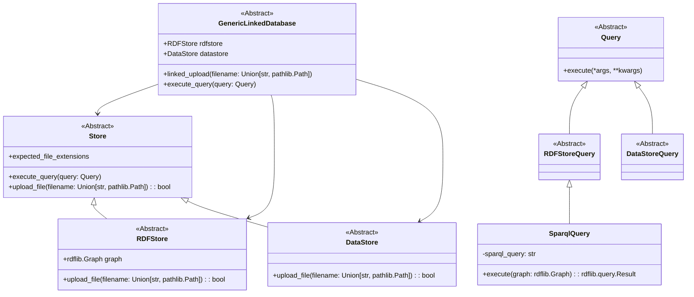

# generic-linked-database


An approach to integrate linked semantic metadata and raw data storage behind a unified interface

## Quickstart

### Installation

Install the package:

```bash
pip install generic-linked-database
```

## Design



### Abstractions

The package provides the following abstractions:
- `GenericLinkedDatabase`: The unified interface to interact with the semantic metadata and raw data storage
- `RDFStore`: The interface to interact with the semantic metadata storage
- `DataStore`: The interface to interact with the raw data storage

The user interacts with the database and can either interact with the metadata store, the data store or via a federated 
query with both.


### Workflow


## TODO:

- [ ] Add documentation
- [ ] Finish readme