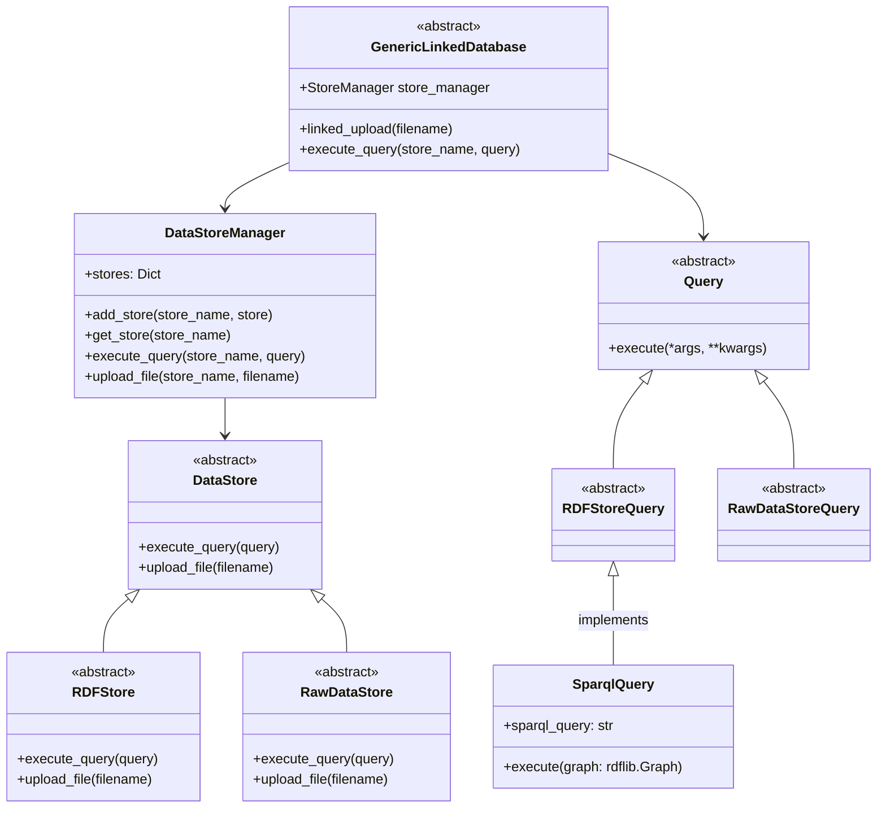

# generic-linked-database


An approach to integrate linked semantic metadata and raw data storage behind a unified interface

## Quickstart

### Installation

Install the package:

```bash
pip install generic-linked-database
```

## Design

### Abstractions

The package provides the following abstractions:
- `GenericLinkedDatabase`: The unified interface to interact with the semantic metadata and raw data storage
- `RDFStore`: The interface to interact with the semantic metadata storage
- `RawDataStore`: The interface to interact with the raw data storage
- `DataStoreManager`: The manager to interact with the different data stores
- `Query`: The interface to interact with the different data stores
- `RDFStoreQuery`: The interface to interact with the semantic metadata storage
- `RawDataStoreQuery`: The interface to interact with the raw data storage

### Class Diagram



### Workflow


## TODO:

- [ ] Add documentation
- [ ] Finish readme